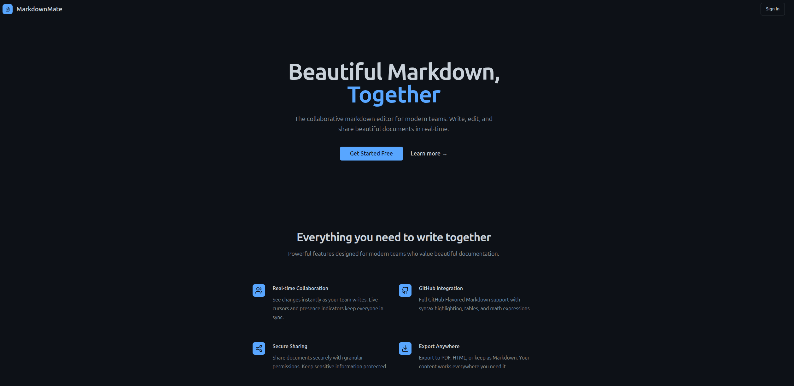

# MarkdownMate

<div align="center">
  <h3 align="center">Beautiful Markdown, Together</h3>
  
  
  
  
  <a href="LICENSE"></a>
</div>

<br>

<p align="center">
  
  <br>
  <em>MarkdownMate: Modern, collaborative markdown editing.</em>
</p>

---

## 📚 Table of Contents

*   [✨ Features](#features)
*   [🛠️ Tech Stack](#tech-stack)
*   [🚀 Quick Start Guide](#quick-start-guide)
*   [☁️ Deployment](#deployment)
*   [🤝 Contributing](#contributing)
*   [📄 License](#license)
*   [📞 Support](#support)

---

## ✨ Features

MarkdownMate is designed to provide a seamless and efficient markdown editing experience.

*   **✍️ Real-time Collaborative Editing**: Work with your team simultaneously. See live cursors and presence indicators.
*   **💻 Monaco Editor Integration**: Enjoy a VSCode-like editing experience with features like intelligent autocomplete and syntax highlighting.
*   **📄 GitHub Flavored Markdown (GFM)**: Full support for GFM, including tables, task lists, and code syntax highlighting.
*   **📱 Modern Responsive UI**: A clean, professional, and intuitive interface that looks great on all devices.
*   **🔒 Secure Document Sharing**: Control who can access and edit your documents with granular permissions (future feature).
*   **📤 Export Options**: Easily export your documents to Markdown. PDF & HTML coming soon!
*   **⚡ WebSocket Powered**: Ensures instant synchronization of changes across all connected users.
*   **🎨 Professional Design**: A GitHub-inspired color scheme and typography for a familiar and productive environment.

<br>

<p align="center">
  
  <br>
  <em>The MarkdownMate editor: Feature-rich and user-friendly.</em>
</p>

---

## 🛠️ Tech Stack

MarkdownMate is built with a modern and robust technology stack, leveraging powerful tools like React for a dynamic frontend experience.

**Frontend:**
<p>
  
  
  
  
  
</p>

<br>

**Editor & Markdown:**
<p>
  
  
  
</p>

<br>

**Real-time & Backend:**
<p>
  
  
  
  
</p>

<br>

**Database & ORM:**
<p>
  
  
</p>

<br>

**Build, Test & Deployment:**
<p>
  
  
  
</p>

---

## 🚀 Quick Start Guide

Get MarkdownMate up and running in a few simple steps:

1.  **Clone the Repository:**
    ```bash
    git clone https://github.com/hexawulf/MarkdownMate.git
    cd MarkdownMate
    ```

2.  **Install Dependencies:**
    ```bash
    npm install
    ```

3.  **Set up Environment Variables:**
    *   Create a `.env` file by copying `.env.example` (if it exists, otherwise create `.env` from scratch).
    *   Fill in your Firebase and database credentials in the `.env` file.

4.  **Run Database Migrations:**
    ```bash
    npm run db:push # Or the relevant migration command for your setup
    ```

5.  **Start the Development Servers:**
    *   Backend server:
        ```bash
        npm run dev:server
        ```
    *   Frontend client (in a new terminal):
        ```bash
        npm run dev:client
        ```

The application should now be available at `http://localhost:5173` (or the port Vite assigns).

For production builds, use `npm run build` and serve the `dist` folder.

---

## ☁️ Deployment

### GitHub Pages

The project includes a GitHub Actions workflow (`.github/workflows/deploy.yml`) for automatic deployment to GitHub Pages:

1.  Ensure your repository is public for GitHub Pages free tier.
2.  In your repository settings under "Pages":
    *   Set the source to "GitHub Actions".
3.  Pushing to the `main` branch will trigger the deployment.

*Note: GitHub Pages is best for static sites. For full backend functionality, use a platform like Vercel or Heroku.*

### Vercel

1.  **Sign up or Log in** to [Vercel](https://vercel.com).
2.  **Import Your Project**:
    *   Click "Add New..." -> "Project".
    *   Connect your Git provider and select the `MarkdownMate` repository.
3.  **Configure Your Project**:
    *   Vercel usually auto-detects Vite projects.
    *   **Build Command**: `npm run build` (or `vite build`)
    *   **Output Directory**: `dist`
    *   **Install Command**: `npm install`
    *   Set up necessary **Environment Variables** in the Vercel project settings (for Firebase, database, etc.).
4.  **Deploy**. Vercel will automatically deploy your project and provide a URL. Future pushes to the connected branch will trigger automatic redeployments.

---

## 🤝 Contributing

We welcome contributions to MarkdownMate!

1.  **Fork the repository.**
2.  **Create a new branch** for your feature or bug fix: `git checkout -b feature/your-amazing-feature` or `bugfix/issue-tracker-fix`.
3.  **Make your changes.** Ensure your code follows the project's style and conventions.
4.  **Commit your changes** with clear, descriptive messages: `git commit -m 'feat: Add X feature that does Y'`.
5.  **Push to your forked repository:** `git push origin feature/your-amazing-feature`.
6.  **Open a Pull Request** to the `main` branch of the `hexawulf/MarkdownMate` repository.

For more detailed guidelines, please see the [CONTRIBUTING.md](CONTRIBUTING.md) file.

---

## 📄 License

This project is licensed under the MIT License. See the [LICENSE](LICENSE) file for details.

---

## 📞 Support

*   **Found a Bug?** Open an issue on [GitHub Issues](https://github.com/hexawulf/MarkdownMate/issues).
*   **Have a Question or Idea?** Start a discussion on [GitHub Discussions](https://github.com/hexawulf/MarkdownMate/discussions).
*   **Need Help?** Check the documentation or reach out via Discussions.

---

<div align="center">
  <p>Made with ❤️ for the developer community.</p>
  <p>
    <a href="https://github.com/hexawulf/MarkdownMate">⭐ Star this Repo</a> |
    <a href="https://github.com/hexawulf/MarkdownMate/issues/new?assignees=&labels=bug&template=bug_report.md&title=%5BBUG%5D">🐛 Report a Bug</a> |
    <a href="https://github.com/hexawulf/MarkdownMate/issues/new?assignees=&labels=enhancement&template=feature_request.md&title=%5BFEATURE%5D">💡 Request a Feature</a>
  </p>
</div>
